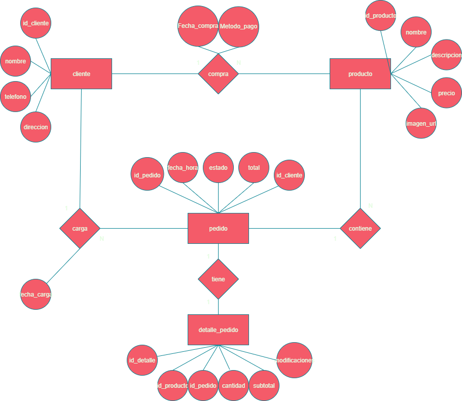

# 🍽️ Mestiza Restaurante - Proyecto Web desarrollado por Vanella Dev

Este proyecto es una aplicación web para el restaurante *Mestiza*, desarrollada como trabajo final. Está enfocada en permitir a los clientes realizar reservas, consultar el menú, visualizar eventos próximos y pedir delivery desde la web.

---

## 🚀 Funcionalidades actuales

- Ver productos del restaurante (menú)
- Visualización de eventos próximos en un calendario
- Backend con salida JSON para integración con frontend (en desarrollo)
+ Panel de administración para gestionar productos y pedidos (CRUD básico)
+ Endpoints para administración: creación, listado, actualización y cambio de estado de pedidos
+ APIs públicas para listado de productos consumidas por el frontend

---

## 🛠️ Tecnologías utilizadas

- **Frontend:** HTML5, CSS, JavaScript (scripts estáticos y manejo de carrito/reservas)
- **Plataforma de desarrollo:** Visual Studio Code
- **Backend:** PHP (estructuras tipo MVC simples)
- **Base de datos:** MySQL (script incluido)
- **Servidor local:** Apache (XAMPP)

---

## 🧱 Estructura del Proyecto

```
PROYECTO-FINAL/
├── admin/
│   ├── backend/
│   │   ├── auth/                   # login/logout/me/seed/reset admin
│   │   │   ├── login.php
│   │   │   ├── logout.php
│   │   │   ├── me.php
│   │   │   ├── seed_admin.php
│   │   │   └── reset_admin.php
│   │   ├── config/
│   │   │   ├── conexion.php        # configuración DB para admin
│   │   │   └── session.php         # helpers de sesión
│   │   ├── estadisticas/           # endpoints de estadísticas
│   │   │   └── resumen.php
│   │   ├── pedidos/                # endpoints para pedidos
│   │   │   ├── list.php
│   │   │   ├── create.php
│   │   │   ├── change_state.php
│   │   │   ├── update_estado.php
│   │   │   ├── estado_publico.php
│   │   │   └── status.php
│   │   └── productos/              # endpoints para productos (CRUD)
│   │       ├── list.php
│   │       ├── create.php
│   │       ├── update.php
│   │       └── delete.php
│   └── frontend/
│       ├── login.html
│       ├── productos.html
│       ├── pedidos.html
│       ├── estadisticas.html
│       ├── js/
│       │   ├── admin-common.js
│       │   ├── productos-admin.js
│       │   └── pedidos-admin.js
│       └── style/
│           └── admin.css
├── fronted-mejor/                   # frontend público mejorado
│   ├── index.html
│   ├── menu.html
│   ├── reservas.html
│   ├── calendario.html
│   ├── pago.html
│   ├── opiniones.html
│   ├── imagenes/
│   ├── js/
│   │   ├── menu.js
│   │   ├── producto.js
│   │   ├── cart.js
│   │   ├── pago.js
│   │   ├── reserva.js
│   │   ├── calendario.js
│   │   └── opiniones.js
│   └── php/
│       ├── guardar_opinion.php
│       ├── mostrar_opiniones.php
│       └── backend/
│           ├── config/
│           │   └── database.php   # configuración DB del backend público
│           ├── controllers/
│           │   └── productos.php
│           ├── models/
│           │   └── Producto.php
│           └── routes/
│               └── api.php        # endpoint público: lista de productos (JSON)
├── uploads/
│   └── products/                    # imágenes subidas por admin (vacía por ahora)
├── vanella_schema.sql               # Script SQL para crear la base de datos
└── MER.jpg / Mer.drawio.png         # Diagrama entidad-relación (si está presente)
```

---

## 🔁 Endpoints y rutas

- Frontend público (páginas):
  - http://localhost/PROYECTO-FINAL/fronted-mejor/index.html
  - http://localhost/PROYECTO-FINAL/fronted-mejor/menu.html

- API público de productos (JSON):
  - http://localhost/PROYECTO-FINAL/fronted-mejor/php/backend/routes/api.php
  - curl http://localhost/PROYECTO-FINAL/fronted-mejor/php/backend/routes/api.php

- Admin (frontend):
  - http://localhost/PROYECTO-FINAL/admin/frontend/login.html

- Admin (endpoints PHP):
  - Listar productos: admin/backend/productos/list.php
  - Crear producto: admin/backend/productos/create.php
  - Actualizar producto: admin/backend/productos/update.php
  - Eliminar producto: admin/backend/productos/delete.php
  - Listar pedidos: admin/backend/pedidos/list.php
  - Cambiar estado de pedido: admin/backend/pedidos/change_state.php
  - Login admin: admin/backend/auth/login.php
  - Seed/reset admin: admin/backend/auth/seed_admin.php, admin/backend/auth/reset_admin.php

---

## 🗃️ Base de datos

- producto
  - id_producto, nombre, descripcion, categoria, precio, imagen_url, personalizable
  - tamanos_precios (JSON) — precios por tamaño/variante
  - Contiene filas de ejemplo (Burger Mestiza, Cheeseburger, tacos, papas, etc.)

- pedidos
  - id_pedido, fecha_hora, cliente_nombre, telefono, direccion, referencia, metodo_pago, total, estado
  - Registra pedidos y su estado (pendiente, aceptado, cancelado, ...)

- pedido_detalle
  - id, id_pedido, producto_nombre, cantidad, precio_unitario
  - Guarda los ítems asociados a cada pedido

- pedido_historial
  - id, id_pedido, estado, fecha_hora
  - Historial de cambios de estado de pedidos

- cliente
  - id_cliente, direccion (info básica de clientes)

- opiniones
  - id, nombre, opinion, fecha, puntuacion
  - Almacena reseñas de clientes

- pedido_old, compra, carga, meta, sobre_nosotros


- `cliente` → realiza → `pedido`
- `producto` → asociado a → `detalle_pedido`
- `detalle_pedido` → pertenece a → `pedido`



---

## 👥 Autores

- Santino Cócaro
- Santiago Beltrán
- Thiago Paulo
- Saihara G. Maranetto

---

## 📜 Licencia

Proyecto con fines educativos.  
Puede ser reutilizado y modificado libremente con propósitos académicos o personales.
