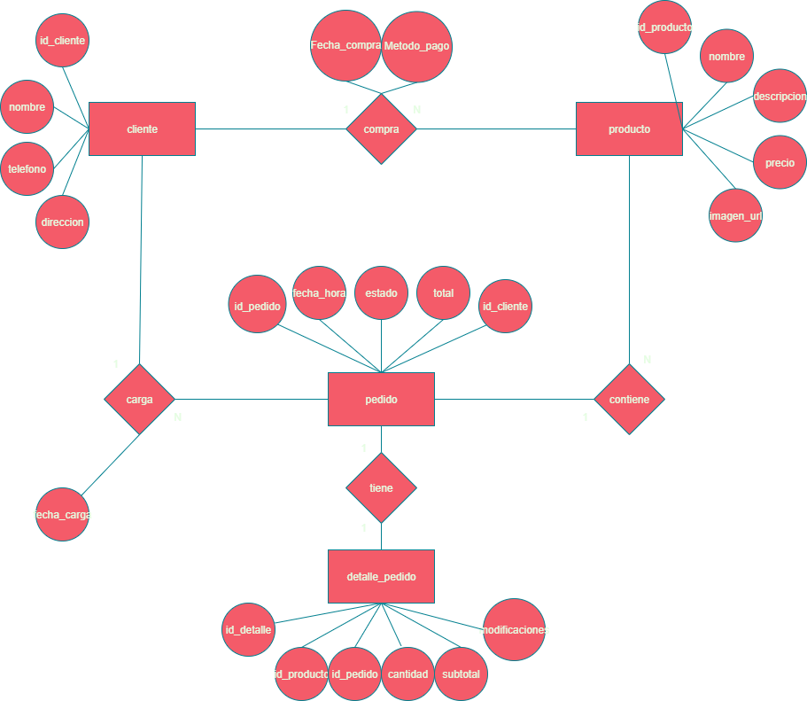

# 🍽️ Mestiza Restaurante - Proyecto Web desarrollado por Vanella Dev

Este proyecto es una aplicación web para el restaurante *Mestiza*, desarrollada como trabajo final. Está enfocada en permitir a los clientes realizar reservas, consultar el menú, visualizar eventos próximos y pedir delivery desde la web.

---

## 🚀 Funcionalidades actuales

- Ver productos del restaurante (menú)
- Visualización de eventos próximos en un calendario
- Backend con salida JSON para integración con frontend (en desarrollo)

---

## 🛠️ Tecnologías utilizadas

- **Frontend:** HTML5, CSS3
- **Backend:** PHP (con XAMPP)
- **Base de datos:** MySQL
- **Servidor local:** Apache (XAMPP)

---

## 🧱 Estructura del Proyecto

```
PROYECTO-FINAL-main/
├── backend/                    # Backend en PHP (estructura tipo MVC)
│   ├── config/                # Conexión a base de datos
│   ├── controllers/          # Controladores API
│   ├── models/               # Lógica de acceso a datos
│   └── routes/               # Punto de entrada para las rutas (API)
├── frontend/
│   └── calendario.html       # Página de eventos futuros
├── MER.jpg                   # Diagrama entidad-relación
└── vanella_schema.sql        # Script SQL para crear la base de datos
```

> ⚠️ Las carpetas `Página/` y `ThiagoBackend/vanella-delivery/` **no se utilizan actualmente** en el proyecto.

---

## ⚙️ Configuración y ejecución

1. Clonar el repositorio:
```bash
git clone https://github.com/usuario/PROYECTO-FINAL.git
```

2. Importar la base de datos:
   - Abrí **phpMyAdmin** desde XAMPP
   - Creá una base de datos nueva (ej: `vanella`)
   - Importá el archivo `vanella_schema.sql`

3. Configurar conexión:
   - Editá `backend/config/database.php` con los datos de tu entorno local

4. Servir los archivos:
   - Colocá la carpeta `PROYECTO-FINAL-main` en `htdocs` de XAMPP
   - Iniciá Apache y MySQL desde el panel de XAMPP

5. Probar el backend:
   - Accedé a `http://localhost/PROYECTO-FINAL-main/backend/routes/api.php`  
     para recibir la respuesta en formato JSON.

---

## 🔁 API REST (en desarrollo)

El backend devuelve datos de productos en formato **JSON**, permitiendo integrarlo con interfaces modernas (JavaScript, frameworks, apps móviles, etc.).

Ejemplo de respuesta:
```json
[
  {
    "id": 1,
    "nombre": "Pizza Margarita",
    "descripcion": "Tomate, muzzarella, albahaca",
    "precio": 450
  },
  ...
]
```

---

## 🗃️ Base de datos

La estructura del sistema está basada en las siguientes entidades:

- `cliente` → realiza → `pedido`
- `producto` → asociado a → `detalle_pedido`
- `detalle_pedido` → pertenece a → `pedido`



---

## 🧑‍💼 Futuras mejoras

- Sistema de autenticación de administradores
- ABM de productos, eventos y reservas
- Integración completa con frontend dinámico
- Carrito de compras y pedidos online
- Gestión de reservas con confirmación automática

---

## 📌 Estado del proyecto

> 🔧 En desarrollo — Módulos funcionales: API de productos y calendario de eventos.

---

## 👥 Autores

- Santino Cócaro
- Santiago Beltrán
- Thiago Paulo
- Saihara G. Maranetto

---

## 📜 Licencia

Proyecto con fines educativos.  
Puede ser reutilizado y modificado libremente con propósitos académicos o personales.
